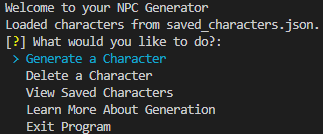
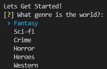
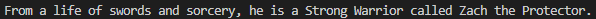
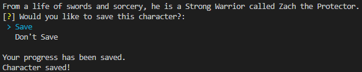
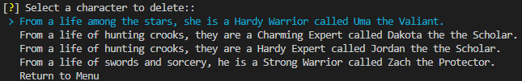
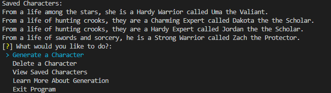
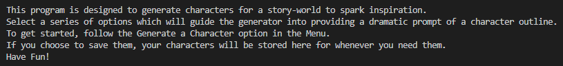
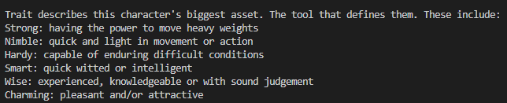

# How to Use
## Requirements
This app requires Python 3 to be used. The internal libraries have been downloaded into a Virtual Environment so nothing else requires installation. The libraries used within this program can be found in requirements.txt. 

## How to Install and Run
The depository for the code can be found at https://github.com/BenGormanCode/NPC-Generator.

To start the app, it can be run through the terminal with 'python3 main.py'. 

## Navigating
To enter your name, simply type it.  
Up, down, left, right can be used to navigate the menu.    
Enter is used to confirm choices.   

## Menu
When you reach the menu, the user will be selected with these options. 

- Generate a Character
- Delete a Character
- View Saved Characters
- Learn about Generation
- Exit Application

 

## Generate a Character
When generating a character, the program will offer a series of prompts that allow the user to flavour their character prompt. The choices that are made during this step will affect the end result.

 

The four categories for choices are Genre, Identity, Trait and Background. There are also two hidden categories called Name and Title which are generated based on their choices. These will be explained further in the 'Learn about Generation' section. 

Once the user has gone through their choices, the program will generate the prompt which will look like this: 

 

## Saving a Character
If they like this character, the user may choose whether to save it or not. Saved characters are saved to a json file meaning that whenever the program is loaded, they will have access to all of their prompts. 

 

## Delete a Character
When opening this menu, the user will be presented with the previously saved characters. If they delete them, they are removed from the json file, and are gone. The user will also be given the option to return to the menu if they wish to delete nothing. If there are no characters to delete, it will say as such. 

 

## View Saved Characters
Viewing saved characters will print all of the saved characters on the json file to the screen. If there are none, it will say as such. 

 

## Learn More About Generation
This option will take the user to a screen where they can see a guide on how to use the program or learn about the generation steps. 

 

The generation steps shows what the categories of questions are as well as giving an indepth detailing of their definitions. 

 

## Exit the Program
When selected, exits the program. If the user opted to save, their characters will be there for next time. To start the program again, print "python3 main.py" in the terminal. 